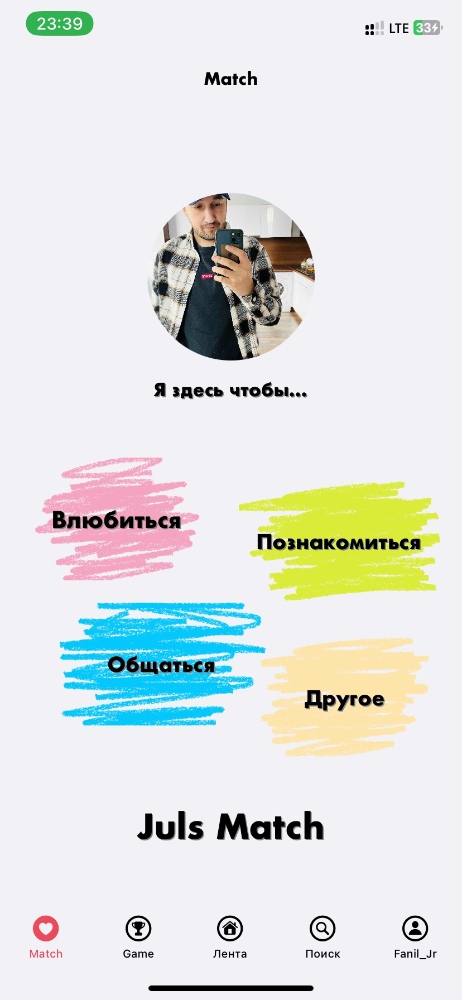

### Привет, Меня зовут Фаниль

В этом приложении имеется работа с: 
Coordinators, Delegate, Completion Block, Firebase (Database, Storage), UserDefaults, просмотр постов, подписки пользователей, публикация постов, создание статуса, редактирование информации пользователя, добавление песни юзера, комментарии, чат

Регистрация и авторизация пользователя происходит по email. Все данные хранятся на Firebase. UserDefault используется для хранения статуса пользователя и никнейма. 
Далее скриншоты:

1. Основной экран профиля:

2. Меню создания поста:

3. Меню изменения статуса и аватара, выход из профиля в LoginController

4. Пост профиля:

6. Поиск людей:

7. Возможность подписаться на пользователя нажав на сердце

8. Лента постов на кого подписан:

9. Комментарии и лайки постов:

10. Match - знакомства

11. Сообщения и личка

12. Ночной режим

В процессе находятся авторизация по номеру телефона, знакомства, игра, хранение понравившихся публикаций CoreData.

Skills: Swift, Firebase, Database, Storage.

  

  
